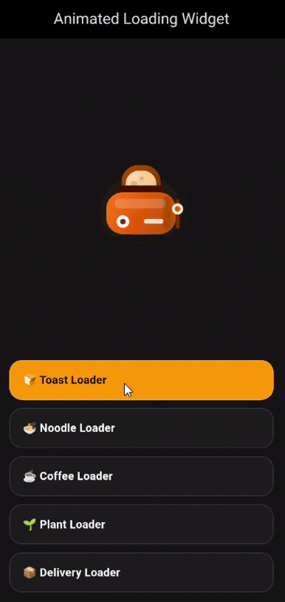

# 🎬 Animated Loading Widget

✨ Beautiful Story-Based Animated Loaders for Flutter ✨
Instead of boring spinners, bring your loading states to life with animated micro-stories 🍞☕🌱📦

---

## 🚀 Why Animated Loading Widget?

Most Flutter loading packages only provide:

- circles
- bars
- dots
- generic animations

`animated_loading_widget` focuses on:

✅ Creative storytelling loaders  
✅ Smooth Flutter animations  
✅ Beautiful handcrafted UI motion  
✅ Fun and memorable loading experiences  

---

# 🎥 Preview

> A collection of aesthetic animated loaders for Flutter.

🍞 Toast Loader  
🍜 Noodle Loader  
☕ Coffee Loader  
🌱 Plant Loader  
📦 Delivery Loader  

<p>
  
</p>

---

# ✨ Included Loaders

## 🍞 Toast Loader
Bread goes inside toaster → gets toasted → pops out with steam.

---

## 🍜 Noodle Loader
Noodles swirl around a fork while loading.

---

## ☕ Coffee Loader
Coffee machine slowly pours coffee into the cup.

---

## 🌱 Plant Loader
Seed grows into a beautiful blooming plant.

---

## 📦 Delivery Loader
Scooter delivers package with smooth motion animation.

---

# 📦 Installation

Add dependency:

```yaml
dependencies:
  animated_loading_widget: ^0.0.1
```
  
# 🌐 GitHub
View source code, report issues, or contribute here:

  
# 🌐 GitHub
View source code, report issues, or contribute here:

https://github.com/Sakshi-2508/animated_loading_widget
